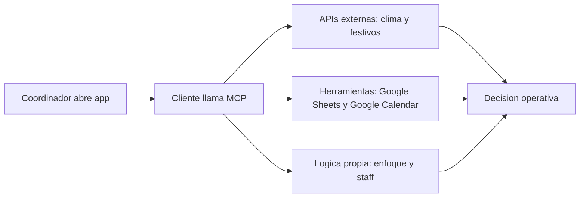
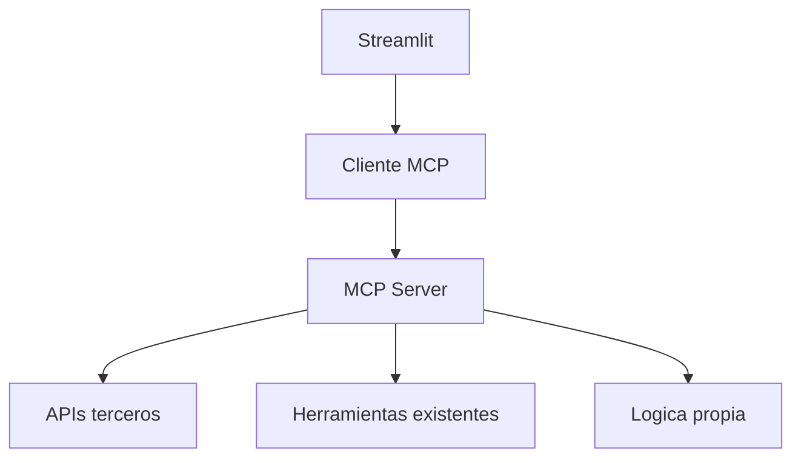

# Nombre_Apellido1_MCP_App

## 1. Ambito y contexto de negocio
El proyecto se centra en un **gimnasio boutique**.

### Problema detectado
El coordinador tarda en:
- registrar nuevos socios,
- crear sesiones en calendario,
- decidir enfoque de sesion y numero de entrenadores por turno.

### Objetivo IA + MCP
Centralizar operaciones en un MCP Server y consumirlas desde una app simple.

## 2. Analisis y consultoria IA

### 2.1 Oportunidades de valor
1. Menos tareas manuales administrativas.
2. Mejor planificacion de sesiones.
3. Mejor asignacion de personal tecnico.

### 2.2 Flujo de trabajo

### 2.3 Necesidades cubiertas por grupos de tools
#### A) APIs de terceros
1. `api_weather_forecast` (Open-Meteo).  
2. `api_public_holidays` (Nager.Date).

#### B) APIs de herramientas existentes
1. `tool_google_sheets_add_member`.  
2. `tool_google_calendar_create_session`.

Nota: en este proyecto ambas estan en modo simulado para simplificar la entrega.

#### C) Tools con logica propia
1. `logic_recommend_session_focus`.  
2. `logic_plan_coach_staff`.

## 3. Implementacion tecnica
### 3.1 Arquitectura

### 3.2 Codigo relevante
- `src/mcp_server/server.py`: registro de 6 tools.
- `src/mcp_server/tools_third_party.py`: Open-Meteo y Nager.Date.
- `src/mcp_server/tools_existing.py`: Google Sheets y Google Calendar.
- `src/mcp_server/tools_custom.py`: reglas de sesiones y entrenadores.
- `src/client/mcp_client.py`: cliente MCP por `stdio`.
- `src/client/app.py`: interfaz con 6 funcionalidades.

## 4. Integracion en aplicacion
Funcionalidades:
1. Consultar clima.
2. Consultar festivos.
3. Registrar socio en Google Sheets.
4. Crear sesion en Google Calendar.
5. Recomendar enfoque de sesion.
6. Planificar entrenadores por turno.

Cada accion llama una tool MCP y muestra JSON de salida.

## 5. Pruebas y evidencias
1. Captura de cada pestaña.
2. JSON de salida de cada tool.
3. Evidencia de `modo=simulado` en Sheets y Calendar.

## 6. Referencias
- MCP: https://modelcontextprotocol.io/
- Open-Meteo: https://open-meteo.com/
- Nager.Date: https://date.nager.at/
- Google Sheets: https://workspace.google.com/products/sheets/
- Google Calendar: https://workspace.google.com/products/calendar/
